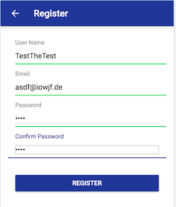

# GeoSound
## Description
This app is linked to the [GEOSOUND API](https://github.com/verdonarthur/GeoSound) developped during the Webserv course. It lets user record and locate sounds.

## Deployment 
The app has not been published on the Play Store. It can be deployed to a phone using Ionic built in tools.
See [Ionic documentation on testing and deploying the app on a phone.](https://ionicframework.com/docs/v1/guide/testing.html)
On Android, deploying the application should be as simple as this command line (given that you have Android Studio installed and configured):

``ionic cordova run android``

## What's inside the app ?
The app lets you :
* Login
* Register
* See sounds on a map
* See all sounds classified by categories
* Record and upload your own sounds
* Edit and delete your own sounds

###Login

Enter your credentials to login to the app or touch register to register.

###Register
 You can register by filling up the form. Choose a user name, a valid e-mail and a password and touch register.

###Browse sounds
 
Sounds are displayed by category. You can chose a category by touching it and listen to the recorded sounds.

###Map of sounds
 
Sounds are displayed by category. You can chose a category by touching it and listen to the recorded sounds.
