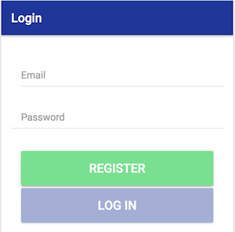

# GeoSound
## Description
This app is linked to the [GEOSOUND API](https://github.com/verdonarthur/GeoSound) developped during the Webserv course. 
It lets user record and locate sounds.

## Deployment 
The app has not been published on the Play Store. It can be deployed to a phone using Ionic built in tools.
See [Ionic documentation on testing and deploying the app on a phone.](https://ionicframework.com/docs/v1/guide/testing.html)
On Android, deploying the application should be as simple as this command line (given that you have Android Studio installed and configured):

``ionic cordova run android``

## What's inside the app ?
The app lets you :
* Login
* Register
* See sounds on a map
* See all sounds classified by categories
* Record and upload your own sounds
* Edit and delete your own sounds

###Login

Enter your credentials to login to the app or touch register to register.

###Register

You can register by filling up the form. Choose a username, a valid e-mail and a password. 
Touch register to confirm registration. A pop up will confirm the registration and redirect you to the login page.

###Browse sounds 
Sounds are displayed by category. You can chose a category by touching it and listen to the recorded sounds. 
The "My Sounds" category will list all of your sounds.

By touching  "view" you can access the details of a sound. If the sound is yours, you will be able to edit or delete a sound. 

###Map of sounds
By touching the "Map Of Sounds" tab, you'll be able to see where sounds have been recorded. You can click on a sound or 
on a cluster of sound to open the sound's detail page and be able to listen to it. If you own the sound you opened,
you'll be able to edit or delete the sound from there.
 
###Recording a sound
By touching the "Record Sound" tab you'll be able to record a sound. After recording the sound you'll be able to enter a
description, chose categories, describe the sound quality and finally confirm the upload.

